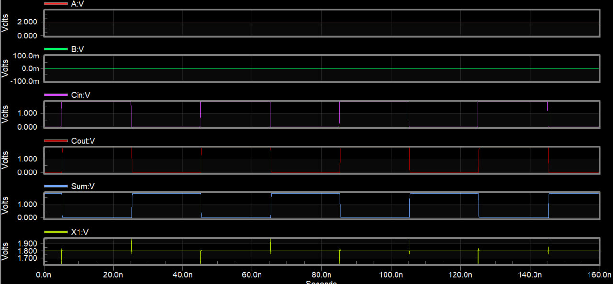

# CMOS Full Adder Design and Simulation

## 1. 1-Bit Full Adder

The 1-bit Full Adder is implemented using transistor-level CMOS logic gates and simulated in Tanner T-Spice. It takes three binary inputs (A, B, and Cin) and generates two outputs: Sum and Carry-out (Cout).

### Performance Metrics
| Metric | Sum | $C_{out}$ |
|:---|---:|---:|
| $T_r$ (Rise Time) | 133.2871 ps | 117.5888 ps |
| $T_f$ (Fall Time) | 97.9716 ps | 92.5223 ps |
| $T_{plh}$ (Low-to-High Delay) | 216.4226 ps | 204.2583 ps |
| $T_{phl}$ (High-to-Low Delay) | 196.8354 ps | 216.7416 ps |
| $T_p$ (Avg. Prop. Delay) | 206.6290 ps | 210.4999 ps |
| $P_{avg}$ (Average Power) | $7.0422\,\mu W$ | $7.0422\,\mu W$ |

**Average Power Consumption:** $P_{avg} = 7.0422\,\mu W$

### Output Waveforms

**Figure 1.** Simulated waveforms for A = 1, B = 0, and varying Cin.

## 2. 4-Bit Ripple Carry Adder

The 4-bit Ripple Carry Adder consists of four cascaded 1-bit CMOS Full Adders. The carry-out of each stage is connected to the carry-in of the next stage.

### Performance Metrics
| Metric | $S_3$ (Sum 3) | $C_{out}$ (Carry) |
|:---|---:|---:|
| $T_r$ (Rise Time) | 133.6552 ps | 117.2394 ps |
| $T_f$ (Fall Time) | 96.8724 ps | 92.6011 ps |
| $T_{plh}$ (Low-to-High Delay) | 862.1975 ps | 827.0337 ps |
| $T_{phl}$ (High-to-Low Delay) | 821.0529 ps | 861.0426 ps |
| $T_p$ (Avg. Prop. Delay) | 841.6252 ps | 844.0381 ps |

**Average Power Consumption:** $P_{avg}=28.1715\,\mu W$

